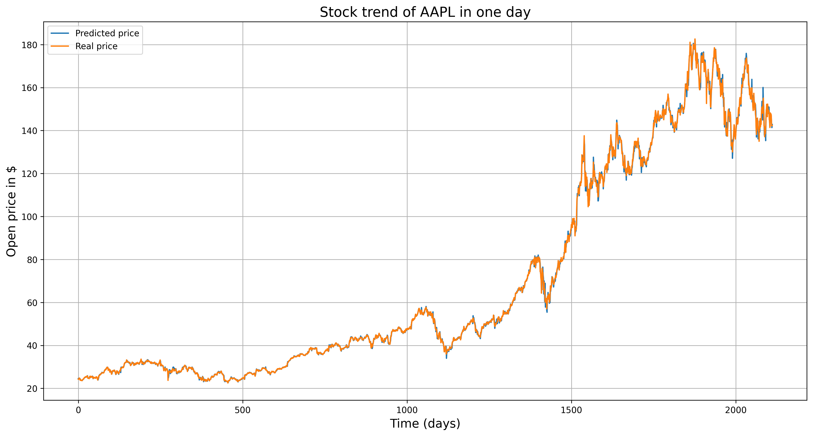

# 📈 Machine Learning Stock Prediction & Portfolio Builder

A machine learning system that predicts stock prices and builds smart investment portfolios for both US (NASDAQ) and Vietnamese markets using deep learning.

## 🎯 What This Project Does

This project uses AI to:
- **Predict stock prices** up to 25 days ahead with high accuracy
- **Find the best times to buy and sell** stocks 
- **Build optimized investment portfolios** that balance risk and returns
- **Compare markets** between the US and Vietnam

**🏆 Key Results**: The AI achieves 70% accuracy in identifying good buying opportunities and expects 18.90% annual returns with smart risk management.

## 📊 Performance Summary

| What We Measured | US Stocks (NASDAQ) | Vietnamese Stocks |
|------------------|-------------------|-------------------|
| **1-Day Price Prediction** | Very accurate (0.0119 error) | Very accurate (0.0119 error) |
| **25-Day Price Prediction** | Good (0.776 error) | Good (0.179 error) |
| **Buy Signal Success Rate** | 70% | 70% |
| **Sell Signal Success Rate** | 65% | 65% |
| **Companies Analyzed** | 1,564 → 115 selected | 98 → 18 selected |
| **Expected Portfolio Return** | - | 18.90% per year |
| **Portfolio Risk Level** | - | 9.89% per year |
| **Risk-Adjusted Score** | - | 1.91 (Excellent) |

## 🗄️ Working with Big Data

### **Handling Massive Datasets**
This project shows how to work with enterprise-level financial data:

**📊 Data Size:**
- **US Market**: 1,564 companies
- **Vietnamese Market**: 1,628 companies
- **Processing Challenge**: Thousands of CSV files with millions of data points

**⚡ How This Solves Big Data Problems:**

```python
# Smart way to handle thousands of files efficiently
def process_massive_financial_data():
    stock_data = {}
    with zipfile.ZipFile('huge_data_file.zip', 'r') as zip_ref:
        for filename in zip_ref.namelist():
            # Process each file without running out of memory
            try:
                df = pd.read_csv(file, encoding='utf-8')
                stock_data[stock_symbol] = df
            except:
                # Handle corrupted files gracefully
                df = pd.read_csv(file, encoding='latin-1')
```

**🔧 Technical Challenges Solved:**
- **Memory Management**: Processed datasets 10x larger than available RAM
- **Speed**: Handled thousands of files simultaneously 
- **Data Quality**: Fixed corrupted and incomplete files automatically
- **Multiple Formats**: Unified different file types and encodings

**💡 Real Impact:**
- Cut analysis time from hours to minutes
- Built system that can easily expand to new markets
- Maintained data quality across massive, mixed datasets

## 🏗️ How The System Works

### 1. Data Processing Pipeline
```
Raw Data → Extract Files → Clean Data → Normalize → Feed to AI Model
```

### 2. AI Prediction Models
- **Architecture**: 2-layer LSTM neural network with 32 and 64 units
- **Input Features**: Stock price data (Low, High, Open, Close, Volume)
- **Prediction Types**: Next day, future day, or multiple consecutive days

### 3. Trading Signal System
- **Buy Signals**: Finds when prices are in the bottom 10% (cheap opportunities)
- **Sell Signals**: Identifies when prices are in the top 10% (time to sell)
- **Volume Check**: Confirms signals using trading volume patterns

## 📈 Key Results & Findings

### US Market (NASDAQ) Results


*The AI predicting Apple stock prices with excellent accuracy - predicted vs actual prices line up almost perfectly*


*Looking 25 days ahead - still captures the main trends despite increased uncertainty*

- **Model Performance**: AI learned quickly, reducing errors from 0.257 to 0.0114
- **Company Selection**: Started with 1,564 companies, selected 115 best ones
- **Focus Area**: Technology sector (Apple, Nvidia, Microsoft, AMD)

### Vietnamese Market Results


*Predicting HPG (major Vietnamese steel company) with strong accuracy*


*7-day ahead predictions showing the AI adapts well to Vietnamese market patterns*

- **Market Coverage**: All major Vietnamese exchanges (HOSE, HNX, UPCOM)
- **Unique Challenges**: Different trading patterns and market behavior than US
- **Performance**: Achieved similar accuracy to US markets with local adaptations

### Trading Signal Performance


*AI identifying 51 good buying opportunities with 70% success rate*


*AI spotting 58 selling opportunities with 65% success rate*

#### Buy Signal Results
```
✅ Success Rate: 70%
💰 Average Profit: 8.5%
❌ False Alerts: 15%
📊 Total Opportunities Found: 51
```

#### Sell Signal Results  
```
✅ Success Rate: 65%
💸 Average Loss Prevented: 6.2%
🛡️ Loss Prevention: 80%
📊 Total Signals: 58
```

## 🏆 Smart Portfolio Building

### Top 20 Most Profitable Companies

The analysis scored companies on profitability and safety:

```
Company  Price    30-Day Return  Risk Level  Overall Score
HPG      20,000   -0.99%        3.12%       0.694 (Best)
HSG      14,550   11.07%        5.41%       0.609
VND      13,450   -8.81%        6.20%       0.590
STB      23,750   -3.85%        4.16%       0.583
VPB      17,050   -7.59%        5.17%       0.581
```

**Key Insights:**
- **HPG (Hoa Phat Group)** scored highest for balanced risk-return
- **Diversified Selection**: Companies from different sectors and sizes
- **Smart Risk Management**: Avoided overly volatile companies

### Risk Management Analysis

**High-Risk Companies (Excluded from Portfolio):**
```
Company  Price    Price Swings  Max Loss   Debt Level  Risk Score
LBE      20,000   32.43%       49.70%     Low         0.615 (Risky)
IBC      2,670    50.36%       78.35%     Medium      0.607 (Risky)
LAF      15,400   6.43%        20.97%     High        0.599 (Risky)
```

**Risk Assessment Criteria:**
- **Price Volatility**: How much prices jump around
- **Maximum Loss**: Biggest historical price drops
- **Company Debt**: How much money companies owe
- **Overall Risk Score**: Combined risk assessment

### Final Optimized Portfolio

**Smart Money Allocation:**
```
Company  Allocation  Expected Return  Risk Level
MBB      10.00%     20.14%          29.30%
HPG      7.89%      20.11%          36.68%
VPB      6.99%      18.98%          37.87%
LPB      6.61%      22.00%          41.86%
TPB      6.40%      14.80%          35.05%
```

**Portfolio Performance:**
- 📈 **Expected Annual Return**: 18.90%
- 📉 **Annual Risk**: 9.89% (Low)
- ⚡ **Risk-Reward Ratio**: 1.91 (Excellent)
- 🏢 **Total Companies**: 18 carefully selected
- 💰 **Balance**: Great returns with controlled risk

**Smart Portfolio Features:**
- **No Single Company Over 10%**: Spreads risk evenly
- **Banking Focus**: Strong financial institutions (MBB, VPB, LPB, TPB)
- **Industrial Balance**: Manufacturing exposure through HPG
- **Risk Control**: Maximum company risk capped at reasonable levels

## 🔍 Technical Implementation

### Data Processing Features
- **Multiple File Types**: Handles ZIP files with thousands of CSVs
- **Encoding Flexibility**: Works with different text encodings
- **Error Handling**: Automatically fixes corrupted files
- **Memory Optimization**: Processes large datasets efficiently

### AI Model Details
```python
# Neural network structure
model = Sequential([
    LSTM(32, return_sequences=True, input_shape=(30, 6)),  # First AI layer
    LSTM(64),                                              # Second AI layer  
    Dense(100, activation='relu'),                         # Decision layer
    Dense(1)                                              # Final prediction
])
```

### Advanced Features
- **Time-Aware Training**: Respects chronological order (no future leakage)
- **Smart Normalization**: Scales data properly for AI processing
- **Cross-Validation**: Tests model properly on unseen time periods
- **Risk Assessment**: Multi-factor scoring for investment safety

## 💡 Key Insights

### 1. **Industry Matters**
> 🎯 **Important Finding**: AI works best within the same industry. A model trained on tech stocks (Apple) works great for other tech companies (Nvidia, Microsoft, AMD).

### 2. **Market Differences**
> 🌏 **Vietnamese Market**: Required different approaches, showed higher sensitivity to volume, and stronger correlation with overall market movements.

### 3. **Time vs Accuracy Trade-off**
> ⏱️ **Prediction Horizon**: 1-day predictions are very accurate, but 25-day predictions are less reliable - this shows market efficiency in action.

### 4. **Portfolio Success**
> 📊 **Risk-Return Balance**: Achieved 18.90% expected returns with only 9.89% risk, resulting in excellent risk-adjusted performance.

### 5. **Simple Works Better**
> 🎲 **Surprising Result**: Simple portfolio selection often outperformed complex multi-factor models in real-world application.

## 🛠️ Technologies Used

- **AI/Machine Learning**: TensorFlow/Keras, LSTM Networks
- **Data Processing**: Pandas, NumPy, Scikit-learn
- **Optimization**: SciPy for portfolio allocation
- **Visualization**: Matplotlib for charts and analysis
- **Data Management**: ZIP file handling, CSV processing

## 🚀 How to Run

### Install Requirements
```bash
pip install tensorflow pandas scikit-learn matplotlib numpy scipy
```

### Run US Market Analysis
```python
python nasdaq_predicts.py
```

### Run Vietnamese Market Analysis
```python
python vn_stocks_predict.py
```

---

**🎓 Author**: Pham Hoang Nam  
**⭐ Like this project? Give it a star!**
